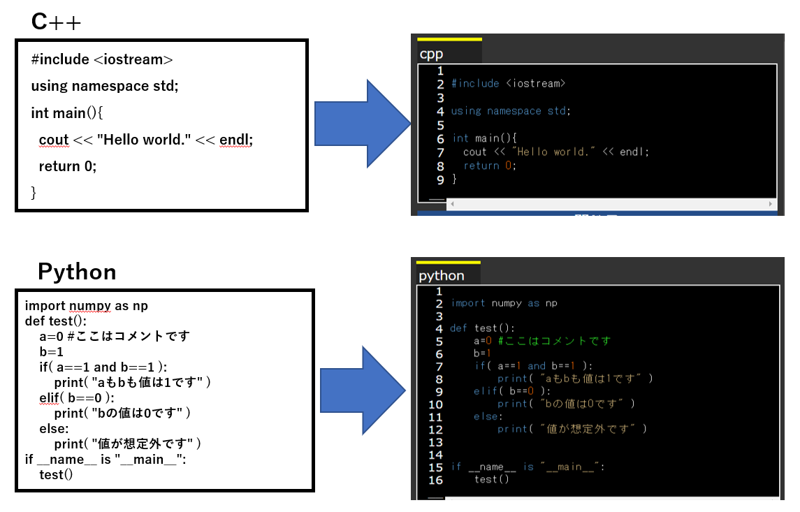

こんな感じで、C++やPython、JavaのスクリプトをHTML形式に変更する。その時にスクリプト内の特定の文字列に色を付けることができる。

実行するにはrun.pyを実行すればOK。デフォルトではtest_sample.cppを読み込んで、色付してHTMLに変換した結果をoutput_test.htmlに保存するようになっている。このファイル名の設定はrun.pyの＿_init＿_()関数に書かれている。

配色の設定はcolor_setting.xmlで行う。

